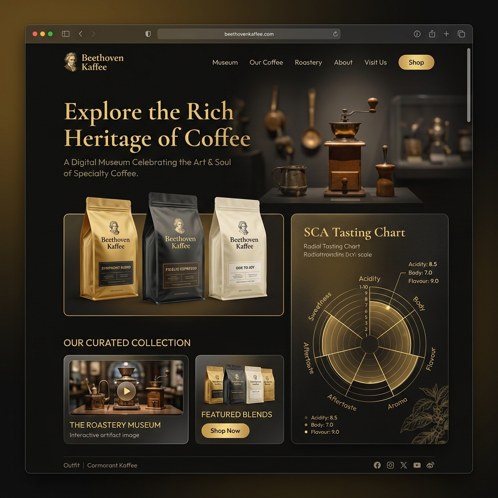

# Beethoven Kaffee — Portal de Especialidad & CMS

<div align="center">
  
</div>

Bienvenido al repositorio oficial de **Beethoven Kaffee**, una plataforma digital premium diseñada para exhibir la herencia de los micro-lotes de café cultivados en las faldas volcánicas de La Florida, Nariño, Colombia. 

Este proyecto incluye una experiencia interactiva para el consumidor final estructurada como un museo digital y un panel de administración robusto (CMS) integrado en tiempo real con Firebase.

---

## Prerrequisitos

Para la ejecución local del proyecto, usted necesitará contar con los siguientes elementos instalados en su estación de trabajo:

* **Node.js** (Versión 18.0.0 o superior recomendada).
* **npm** (Administrador de paquetes de Node, incluido por defecto con Node.js).
* Una cuenta activa en la **Consola de Firebase** para la creación y gestión del proyecto de base de datos.

---

## Configuración del Proyecto en Firebase

La aplicación está preconfigurada en el código para comunicarse con el proyecto Firebase `beethoven-kaffee-2026`. Para garantizar el funcionamiento correcto de las características dinámicas, usted debe aprovisionar y activar los servicios correspondientes en su consola siguiendo estas indicaciones:

### 1. Activar Firebase Authentication
El panel administrativo utiliza autenticación por medio de usuario y contraseña:
* Diríjase a su **Consola de Firebase** y acceda a su proyecto.
* En el menú lateral izquierdo, seleccione **Build** > **Authentication**.
* Haga clic en la pestaña **Sign-in method** y seleccione **Add new provider**.
* Active el proveedor de **Correo electrónico/Contraseña** (Email/Password) y guarde los cambios.

### 2. Habilitar la Base de Datos Cloud Firestore
Tanto el catálogo de cafés especiales como las secciones de texto dinámicas del museo se leen en tiempo real de Firestore:
* En su consola, diríjase a **Build** > **Firestore Database**.
* Haga clic en **Create Database**.
* Defina la ubicación geográfica que mejor se ajuste a su audiencia (se recomienda `nam5` o `us-central`).
* Comience el aprovisionamiento en **Modo de Prueba** (Test Mode) para permitir operaciones de lectura y escritura iniciales de forma directa. 
* *Nota:* En entornos de producción, se recomienda auditar y restringir las reglas de seguridad.

---

## Instalación y Preparación del Entorno

1. **Clonar e Ingresar al Directorio**:
   Navegue hasta la carpeta raíz del proyecto en su terminal de comandos.

2. **Instalar Dependencias**:
   Descargue e instale todos los paquetes necesarios del ecosistema ejecutando el siguiente comando:
   ```bash
   npm install
   ```

3. **Variables de Entorno**:
   El archivo de inicialización de la API de Firebase se encuentra localizado en [src/firebase.ts](src/firebase.ts). Si requiere sustituir las credenciales de conexión por las de un proyecto personal diferente al configurado por defecto, puede definir las variables pertinentes dentro de un archivo `.env` o `.env.local` en la raíz del proyecto.

---

## Guía de Primer Uso y Auto-Sembrado

Para simplificar su primera interacción con la plataforma, la aplicación incluye una lógica de aprovisionamiento autónomo que le evitará tener que crear documentos manualmente en la consola de Firebase:

1. **Auto-Sembrado de Contenido (Auto-Seeder)**:
   Al ingresar al portal por primera vez, el sistema ejecutará un proceso de validación sobre Firestore. Si detecta que la base de datos se encuentra vacía, inyectará de forma automática toda la estructura de datos por defecto de la marca:
   * Los textos literarios e informativos de la sección de cabecera (**Hero**).
   * Los seis capítulos que documentan la secuencia de cultivo, beneficio, secado y tostado.
   * Los seis descriptores de catación de notas sensoriales junto con sus intensidades.
   * La colección inicial de bolsas de café especiales (Bourbon Rosado, Edición Especial Galeras y Tradicional).

2. **Registro Instantáneo de Administrador**:
   Para acceder al gestor de contenidos:
   * Navegue a la ruta de acceso de caficultores en la interfaz o acceda directamente a `/login`.
   * Introduzca el correo preestablecido: `admin@bk.co`.
   * Defina la contraseña de su elección.
   * Al hacer clic en enviar, si el correo electrónico no está registrado en Firebase Auth, la plataforma lo creará en el acto con sus credenciales provistas, concediéndole el acceso de forma transparente al panel de control administrativo (`/admin`).

---

## Comandos Disponibles

### Iniciar el Servidor de Desarrollo
Para levantar el servidor web local con soporte para recarga rápida en el puerto 3000, ejecute:
```bash
npm run dev
```
Acceda a través de su navegador web en `http://localhost:3000`.

### Ejecutar Suite de Pruebas Unitarias de Interfaz
Hemos integrado una suite completa de pruebas unitarias locales utilizando **Vitest** y **React Testing Library** que comprueba el renderizado del museo digital, el cálculo dinámico del gráfico de radar y los hipervínculos de compra automatizados:

* **Ejecución Unica**:
  ```bash
  npm run test
  ```
* **Modo Escucha Activa (Watch)**:
  ```bash
  npm run test:watch
  ```

### Limpieza y Compilación de Producción
Para compilar la aplicación, optimizar los activos estáticos y empaquetar el producto final dentro de la carpeta `dist/`, utilice:
```bash
npm run clean
npm run build
```
